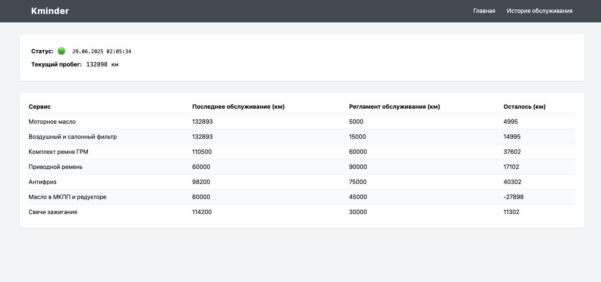

# Kminder (KM + Reminder)




## 🎯 О проекте

Получение информации по текущему пробегу через StarLine API для расчета ТО и напоминания замены расходников

Проект помогает автовладельцам:
- ⏰ Получать напоминания о плановом ТО
- 🔧 Контролировать замену расходных материалов
- 📈 Вести историю обслуживания

### ✨ Возможности

- 🚙 **Мониторинг пробега** — автоматическое получение данных о пробеге через StarLine API
- 📅 **Календарь ТО** — расчет сроков технического обслуживания
- 🔔 **Уведомления** — напоминания о необходимости замены расходников
- 📊 **Веб-интерфейс** — удобная панель управления
- 🐳 **Docker** — простое развертывание в контейнерах
- 📱 **Адаптивный дизайн** — работает на всех устройствах

### 🔐 StarLine API
Открытое StarLine API позволяет владельцам охранных комплексов StarLine создавать приложения для управления своими автомобилями. Единственное, что требуется для использования API это appId и secret, которые вы получаете после регистрации. Если у вас есть желание открыть ваше приложения для других пользователей, то требуется в отдельно порядке заключить договор с компанией StarLine по причине определенных рисков для ваших пользователей.

### Соглашение
Компания StarLine полностью снимает с себя ответственность за вред, причиненный вам и вашему автомобилю посредством неправильного использования API. Отправка запроса на регистрацию означает, что вы принимаете данные условия.

### Регистрация
Для получения доступа к открытому API вам необходим `appId` и `secret`. Вы можете получить их в личном кабинете на [my.starline.ru](https://my.starline.ru). 

`appId` и `secret` позволят вам управлять исключительно вашей машиной. Вопросы можно адресовать на server@starline.ru.

### Ограниченный доступ для физических лиц
Ограничение равно 1000 запросов в день для одного пользователя. Будет выполнятся один запрос в 2 минуты при запущенном сервисе

**Devel page:** https://developer.starline.ru/
**Examples scripts gitlab:** https://gitlab.com/starline/openapi/

Документацию, возможно не обновляют. Не хватает информации, есть неактуальное и устаревшие данные

### Предварительные требования

- 🐳 Docker и Docker Compose
- 🔑 StarLine API credentials (`appId` и `secret`)
- 👤 Аккаунт на [my.starline.ru](https://my.starline.ru)

Для работы нужен `SLID` токен (время жизни токена 1 год)

Можно получить используется скрипт `bin/starline_auth.py`

```bash
cp env.example .env
uv run python bin/starline_auth.py -i API_APP_ID -s API_SECRET -l USER_LOGIN -p USER_PASSWORD
```

Добавить токен в файл `.env`

```bash
docker-compose up -d --build
```

Неверные данные авторизации или слишком частое выполнение скрипта может привести к запросу капчи

### Конфигурация сервисов

Отредактируйте `services.yaml` для настройки интервалов ТО:
```yaml
services:
  oil_change:
    name: "Замена масла"
    interval_km: 6000
    last_service_km: 45000

  brake_pads:
    name: "Замена тормозных колодок"
    interval_km: 30000
    last_service_km: 40000
```


## TO DO:
- Доработать код, добавить аннтоции, исправить ошибки, сделать более читабельным
- Сделать удобный скрипт для получения SLID токена
- Отправка напоминаний в телеграм
- Добавить работу с БД (пока все записи и конфиги в файлах service.yaml + history.yaml данных в целом не много)
- Выводить метрики в Prometheus (Состояние АКБ, топливо, температуру двигателя)
- Веб интерфейс (Попробовать сделать красивый фронт, возможно как отдельный сервис)
- Есть вариант записывать в БД все события по авто можно вытащить из Starline `/{device_id}/events` (открытие авто, запуск двигателя, остановка и т.д.) в удобном формате (сомнительная штука, но так можно)
- Учитывать срок эксплутации расходников, а не только пробег
- Возможно как то с пользой использовать данные по АКБ, температура салона, температура двигателя, баланс сим карты, geo позиция, gsm уровень сигнала, информация по датчику топлива

### Devel

